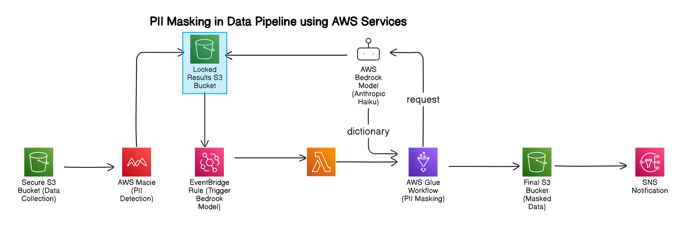

# 🛡️ PII Masking with AWS Bedrock and Macie: Protecting Your Personal Data Before Analysis 🔒

## Introduction

In today's data-driven world, protecting Personally Identifiable Information (PII) is a top priority. This repository provides a comprehensive solution for masking PII and other sensitive data across various file formats stored in Amazon S3. By following the steps outlined in this guide, you'll ensure that your data is secure before it's analyzed. Let's dive into the process, and don't worry, we'll keep it interesting!

## Step 1: Securely Storing Data in S3

First things first, data from various sources lands in a tightly secured S3 bucket. This bucket serves as the initial holding area for your data, which may come in formats like CSV, TSV, JSON, Parquet, and Avro. Think of this bucket as Fort Knox for your raw data. 🚀

### Why Secure S3 Storage?

- **Data Integrity**: Ensures that the data is intact and unaltered.
- **Access Control**: Only authorized personnel and processes can access the data.
- **Compliance**: Helps meet regulatory requirements by protecting sensitive information.

### How to Securely Store Data in S3

1. **Create an S3 Bucket**: Start by creating an S3 bucket specifically for your raw data. Use a naming convention that clearly identifies the bucket's purpose.

2. **Enable Encryption**: Apply server-side encryption to the bucket to protect data at rest. You can use AWS Key Management Service (KMS) to manage encryption keys.

3. **Set Up Access Policies**: Define bucket policies and IAM roles to control who can access the data. Use the principle of least privilege to ensure that only necessary personnel have access.

4. **Enable Logging and Monitoring**: Activate S3 server access logging and set up AWS CloudTrail to monitor and log bucket access and activities. This helps in auditing and detecting any unauthorized access.

5. **Data Transfer Security**: Ensure data is encrypted in transit by using HTTPS for all data uploads and downloads to the S3 bucket.

## Step 2: Running Macie to Detect PII

AWS Macie steps in to scan the data for PII. Macie uses pattern matching and machine learning to identify sensitive information. Once it finds PII, it generates a locked result JSON file and stores it in another S3 bucket.

### Why Use Macie?

- **Automated Detection**: Saves time and reduces manual effort.
- **Accuracy**: High detection accuracy with machine learning.
- **Compliance**: Helps meet data protection regulations.

### How Macie Works

1. **Data Classification**: Macie analyzes the data to identify and classify sensitive information.
2. **Pattern Matching**: It uses predefined patterns to detect PII.
3. **Machine Learning**: Enhances detection accuracy by learning from data patterns.

### Setting Up Macie

1. **Enable Macie**: Start by enabling Macie in the AWS Management Console. Navigate to the Macie dashboard and follow the setup instructions.

2. **Create a Macie Job**: Define a job to scan your S3 bucket. Specify the bucket to be scanned, the frequency of scans, and the types of PII to be detected.

3. **Configure Job Settings**: Customize the job settings to suit your needs. You can set include or exclude criteria to narrow down the scope of the scan.

4. **Run the Job**: Once configured, run the job to start scanning the data in your S3 bucket. Macie will analyze the data and generate a report on detected PII.

### What Happens Next?

After Macie completes the scan, it generates a locked JSON file containing the locations and details of the detected PII. This file is then stored in another S3 bucket, ready for the next steps in the data masking process.

### Benefits of Using Macie

- **Scalability**: Automatically scales to handle large datasets.
- **Efficiency**: Quickly identifies sensitive data across various file formats.
- **Security**: Ensures that PII is detected and handled securely, preventing unauthorized access.

By leveraging AWS Macie, you automate the process of detecting sensitive information, reducing the risk of data breaches and ensuring compliance with data protection regulations.

## Step 3: Using EventBridge to Trigger Bedrock Model

As soon as Macie detects PII and generates the result JSON, an EventBridge rule triggers the Bedrock model, Anthropic Haiku. This model creates a Python dictionary indicating the exact locations (rows and columns) of the PII to be masked.

### EventBridge and Bedrock Model

- **EventBridge**: Captures events from S3 and triggers actions.
- **Anthropic Haiku**: A powerful language model that can parse extremely long JSON files and pinpoint PII locations.

### Why Anthropic Haiku?

- **Language Understanding**: Parses complex JSON structures effectively.
- **Precision**: Accurately identifies the locations of sensitive data.
- **Efficiency**: Handles large datasets with ease.

The Anthropic Haiku model stands out because it is built on advanced language processing capabilities. It’s like having a detective who not only reads between the lines but also understands the context and semantics of each data entry. When your JSON files are extensive and intricate, Haiku steps in to meticulously scan and identify PII locations with pinpoint accuracy, ensuring no sensitive information slips through the cracks.

## Step 4: Masking PII with AWS Glue

Next, an EventBridge rule triggers an AWS Glue workflow to mask the identified PII using PySpark. This step modifies the original data to protect sensitive information while retaining its analytical value.

### AWS Glue and PySpark

- **AWS Glue**: A serverless data integration service that prepares data for analysis.
- **PySpark**: An interface for Apache Spark in Python, used for large-scale data processing.

### Masking Process

1. **Extract**: Pulls the data from S3.
2. **Transform**: Masks the PII as identified by the Bedrock model.
3. **Load**: Stores the masked data back in a different S3 bucket.

By leveraging PySpark, you ensure that the transformation process is efficient and scalable, capable of handling large volumes of data. PySpark’s robust data processing capabilities make it an ideal choice for this task, allowing you to efficiently mask PII while preserving the integrity and usability of your data for further analysis.

## Step 5: Triggering the ETL Pipeline

Once the data is masked, it's stored in another S3 bucket, ready for analysis. This bucket serves as the source for your ETL (Extract, Transform, Load) pipeline. When the process is complete, an SNS notification is sent via email.

### Final Steps

- **ETL Pipeline**: Processes the masked data for analysis.
- **SNS Notification**: Alerts you that the process is complete and data is ready.

### Why Trigger an ETL Pipeline?

- **Data Readiness**: Ensures that only cleansed, masked data enters your analytical workflows.
- **Automation**: Streamlines the data preparation process.
- **Notification**: Keeps stakeholders informed about the data processing status.

## Conclusion

Congratulations! You've set up a robust system for securing and masking PII in your data stored in S3. This process ensures that your data is safe and compliant with regulations before it reaches your ETL pipeline. With AWS services like Macie, EventBridge, Bedrock, and Glue, you've got a powerful toolkit to handle sensitive data securely and efficiently. Now, go ahead and implement this solution to protect your data like a pro! 🎉

For more details on Macie, check out the [AWS Macie Documentation](https://docs.aws.amazon.com/macie/latest/userguide/what-is-macie.html).

By adopting this approach, you are not just enhancing data security but also streamlining your data processing workflows. The integration of these AWS services ensures that your data remains protected and compliant, giving you peace of mind as you proceed with your data analysis. So, take a deep breath, follow these steps, and enjoy the confidence that comes with knowing your data is in safe hands. 🚀
